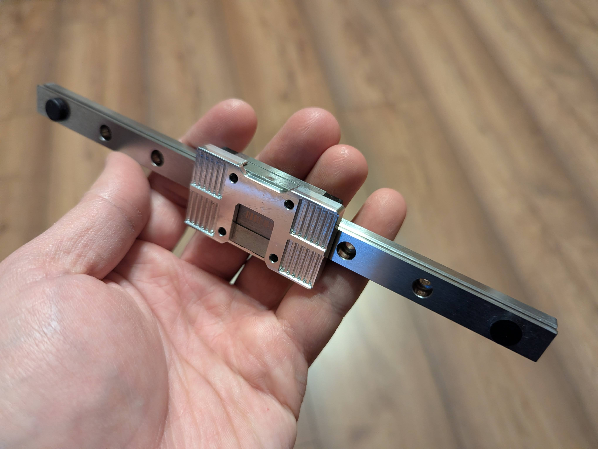

# Milled Belt Clamp

The milled belt clamp, co-developed with **@dderg**.

## CAD

[STEP file](CAD/Monolith_Milled_Belt_Clamp.step)

## LDO milled belt clamp vendors

- [West3D](https://west3d.com/products/monolith-cnc-belt-clamp-by-ldo-motors) (US)
- [MyRigs](https://myrigs3d.com/fr/products/ldo-monolith-cnc-belt-clamp) (EU)
- [Zen3D](https://shop.zen3d.eu/monolith-cnc-belt-clamp) (EU)

The LDO version is black-anodized aluminum.

## Development

Developed from the A-type SLM version. Early prototypes made by @dderg introduced a heatbreak cutout, a flat front, and longer AirTAC carriage compatibility.

