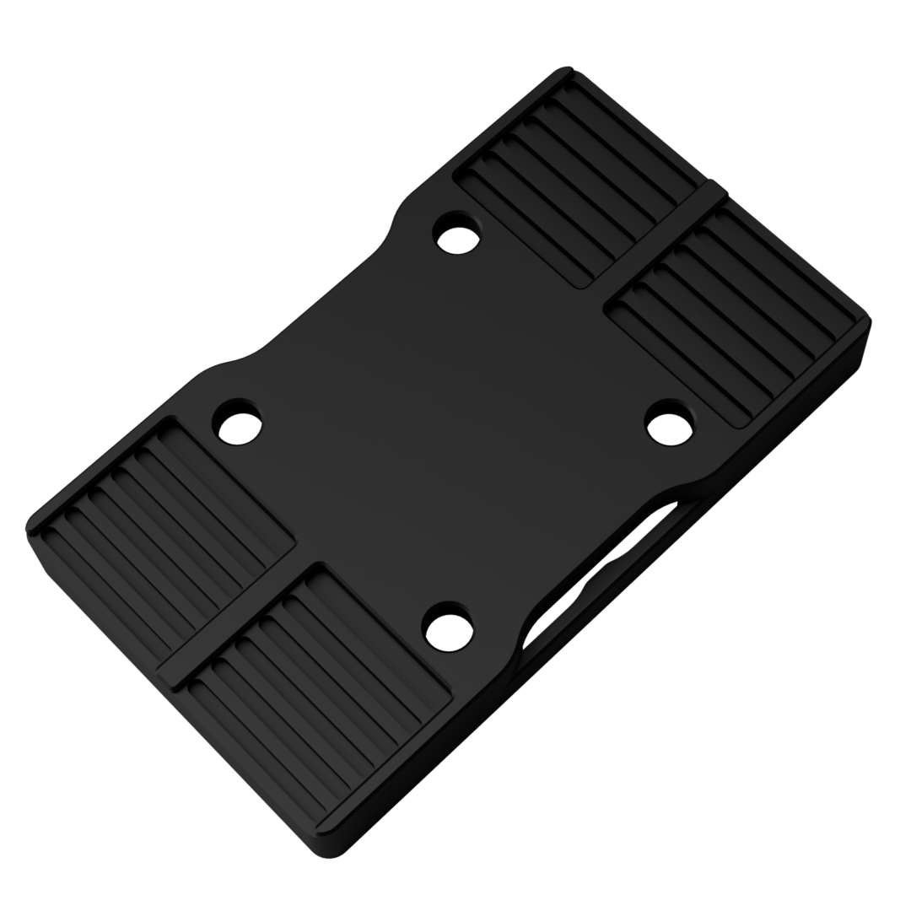

# Monolith Belt Clamp

A metal belt clamp for adapting toolheads to Monolith's flipped belt path, including toolheads with printed carriages.

The belt path runs one belt thickness from the MGN12H carriage, leaving room for a thin clamp around it.

## Design goals

- Single-piece, lightweight, and compact.
- At least six teeth engaged, as recommended by Gates.
- A straight loaded belt section without tight bends.
- Preserve standard 250, 300, and 350 mm X travels.
- Accommodate belts up to 12 mm wide without vertical restriction.
- Clip onto the carriage without screws during toolhead assembly.
- Keep excess belt outside, with easy slack removal using two partially tightened screws.

## Variants

Both versions have the same fit and function and are interchangeable in existing toolhead designs. Prefer milled when getting a new clamp, but there's no reason to replace an SLM clap that already works well.

- [Milled](Milled/): Improved version with more consistent manufacturing. Recommended over SLM.
- [SLM](SLM/): Quality varies by supplier and batch, and the geometry makes manufacturing defects difficult to correct through post-processing.

