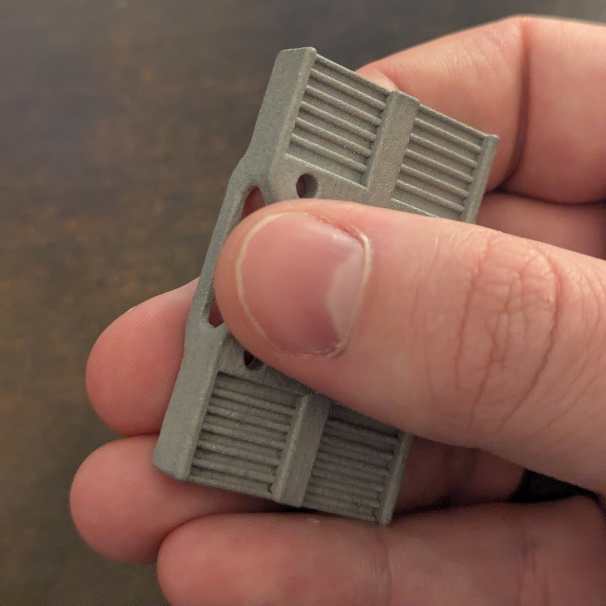

# SLM Belt Clamp

The SLM metal belt clamp for Monolith's flipped belt path.
## CAD

- [STEP file](CAD/Monolith_SLM_Belt_Clamp.step)
- [STL file](STL/Monolith_SLM_Belt_Clamp.stl)

## SLM belt clamp vendors

- [DK Supply](https://diodekingsupply.com/products/monolith-slm-belt-clip) (US)
- [3DKATTEN](https://3dkatten.se/products/monolith-slm-belt-clamp) (EU)
- [Pjotr3DShop](https://pjotr3dshop.com/products/monolith-slm-belt-clamp-aluminium) (EU)

